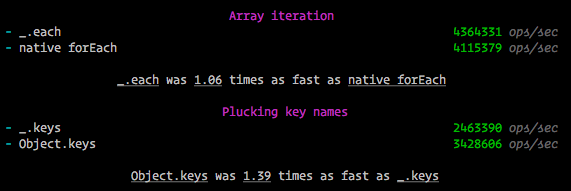

# Terminal Reporter

The [karma-benchmarkjs-reporter](1) by [@rawrmonstar](2) of [@FormidableLabs](3) produces a useful
summary of suites and calls out which benchmark performed the best.



## Installation

```
npm install --save-dev karma-benchmarkjs-reporter
```

## Configuration

The minimum set up is to include `'benchmark'` in the `'reporters'` array of your karma.conf.js.

I would also recommend setting `benchmarkReporter.showSuiteSummary` to `true` to get access to the eg. `Object.keys was 1.39 times as fast as _.keys` summary.

```js
module.exports = function(karma) {
  karma.set({
    // ..other karma config
    benchmarkReporter: {
      showSuiteSummary: true
    },
    reporters: [
      'benchmark'
    ]
  });
};
```

A working example can be found at [karma-benchmark/examples](4) and the full range of configuration options can be found in [karma-benchmarkjs-reporter](1) README.

[1]: https://github.com/FormidableLabs/karma-benchmarkjs-reporter
[2]: https://github.com/rawrmonstar
[3]: https://github.com/FormidableLabs
[4]: https://github.com/JamieMason/karma-benchmark/tree/master/examples
